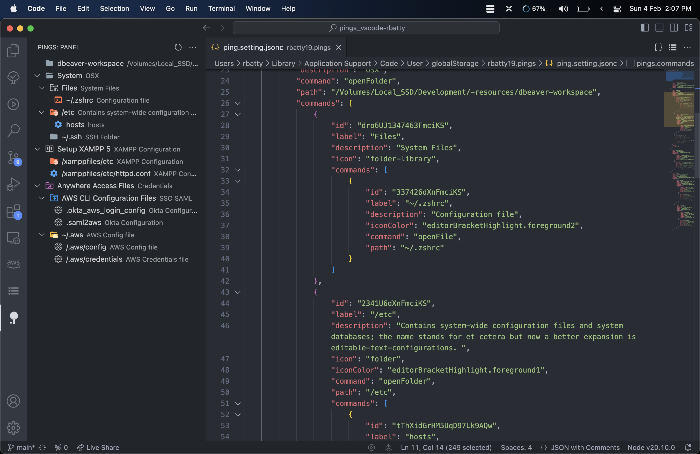
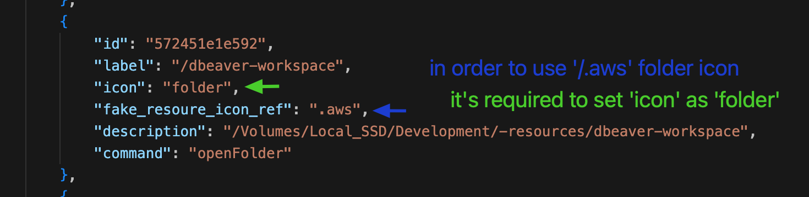

# Pings

The extension adds a panel for accessing frequently used commands, files, directories, URLs, programs, snippets. The panel can be standalone or as part of the Explorer (In this case, you can drag the panel like any other to the desired location).

## for fake icon reference

its required for files and/or folders

